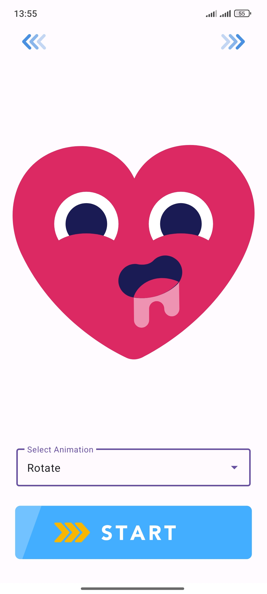
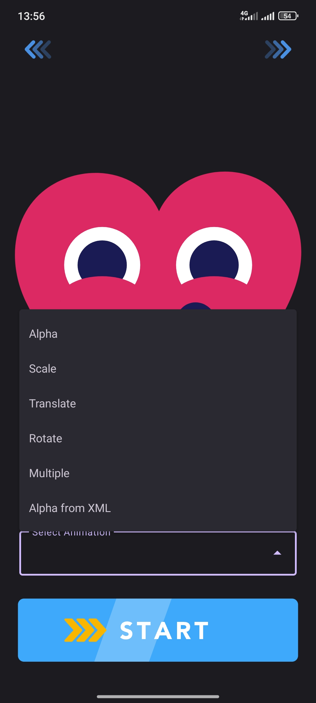
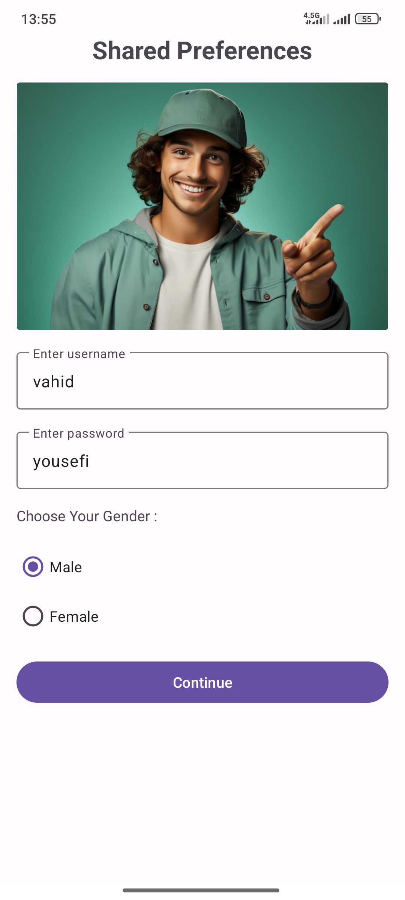
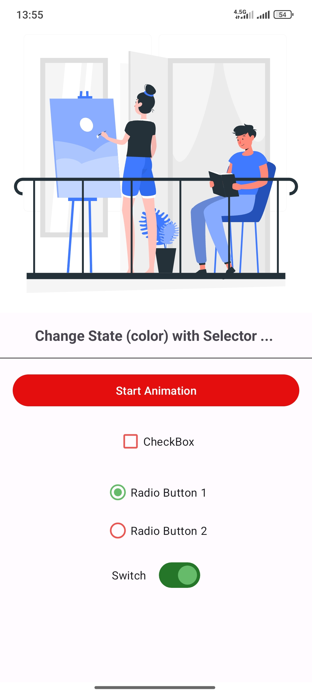

# Animations in Android
This project uses default Android animations
Display ready-made animations using the Lottie library
And save changes using shared Preferences.
In addition to this, we also customized the color of the switches, radio buttons, checkboxes, and buttons.

در این پروژه از انیمیشن های پیشفرض اندروید استفاده شده انیمیشن های آماده رو با استفاده کتابخانه Lottie نمایش دادیم و برای ذخیره تغییرات از
shared Preferences
استفاده کردیم، علاوه بر این حالت رنگ سوییچ ها ،رادیو باتن ها، چک باکس و دکمه رو هم شخصی سازی کردیم.

  |  |
|  |  

# Anims List
* Alpha
* Scale
* Rotate
* Translate
* Multiple (optional)

